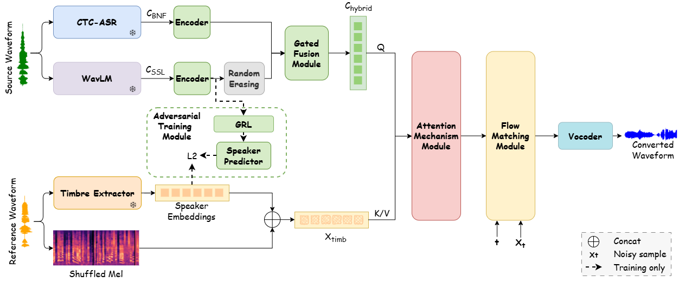
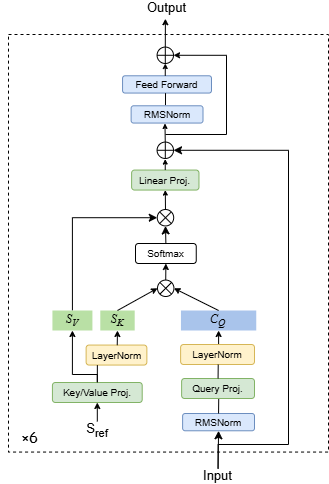

## Abstract

Expressive voice conversion (VC) transfers a source speaker’s timbre to a target while keeping content and expressive traits.
However, existing methods struggle to reproduce non-verbal information in highly expressive speech, such as breathing, crying, or emotional nuances.
Bottleneck features (BNFs) derived from automatic speech recognition (ASR) systems offer robust linguistic representations but often lack expressive details, whereas self-supervised learning (SSL) features capture rich paralinguistic cues but are prone to timbre leakage.
To address these issues, we propose a novel expressive zero-shot VC model that leverages the complementary strengths of BNFs and SSL features. 
A learnable gated fusion module adaptively balances the two, preserving linguistic accuracy while enriching expressive information.
To further reduce timbre leakage in SSL features, adversarial training is incorporated.
In addition, an attention mechanism is employed to adaptively fuse timbre representations with linguistic content.
Experimental results demonstrate that the proposed method significantly improves timbre similarity and naturalness, outperforming state-of-the-art systems in both subjective and objective evaluations.
 
 

    <figure style="text-align: center; margin: 0;">
        
        <figcaption style="text-align: center; font-size: 0.9em; margin-top: 0.5em;">
            <strong>Proposed framework.</strong> 
            <small>Snowflake represents the parameter that remains unchanged when training the framework.</small>
        </figcaption>
    </figure>
    <figure style="text-align: center; margin: 0;">
        
        <figcaption style="text-align: center; font-size: 0.9em; margin-top: 0.5em;">
            <strong>Attention mechanism module.</strong>
        </figcaption>
    </figure>

## Conversion Tasks

Our goal is to transfer the timbre of a source speech to an unseen target speaker while preserving the original content and expressive traits.
We generate waveforms with high timbre similarity, naturalness, and audio quality, while effectively reproducing non-verbal cues in highly expressive speech, such as breathing, crying, and subtle emotional nuances.

- **Proposed** - the Proposed method.
- **SeedVC** - This method is a widely used open-source VC system that incorporates an external timbre shifter and a diffusion transformer.
- **REF-VC** - This method is an end-to-end VC framework that introduces an implicit alignment mechanism to improve audio fidelity.
- **CosyVoice2-VC** - This method is an open-source TTS model that also provides a voice conversion variant.
It adopts a diffusion-based semantic-to-acoustic module, whose strong semantic and acoustic modeling capabilities enable effective zero-shot voice conversion.

## Demos

<table>
<thead>
<tr class="header">
<th>NO</th>
<th>Source</th>
<th>Reference</th>
<th>Proposed</th>
<th>SeedVC</th>
<th>REF-VC</th>
<th>CosyVoice2-VC</th>

</tr>
</thead>
<tbody>
<tr class="odd">
<td>1</td>
<td><audio controls>
				<source src="audios\example\source\zh-cn_shenlige_sadness_57.wav" type="audio/mpeg">
				Your browser does not support this audio format.
			</audio></td>
<td><audio controls>
				<source src="audios\example\prompt\ad00008-prompt-1.wav" type="audio/mpeg">
				Your browser does not support this audio format.
			</audio></td>
<td><audio controls>
				<source src="audios\example\pro\zh-cn_shenlige_sadness_57.wav" type="audio/mpeg">
				Your browser does not support this audio format.
			</audio></td>
<td><audio controls>
				<source src="audios\example\seed\zh-cn_shenlige_sadness_57.wav" type="audio/mpeg">
				Your browser does not support this audio format.
			</audio></td>
<td><audio controls>
				<source src="audios\example\ref\zh-cn_shenlige_sadness_57.wav" type="audio/mpeg">
				Your browser does not support this audio format.
			</audio></td>
<td><audio controls>
				<source src="audios\example\cosy\zh-cn_shenlige_sadness_57.wav" type="audio/mpeg">
				Your browser does not support this audio format.
			</audio></td>
</tr>

<tr class="odd">
<td>2</td>
<td><audio controls>
				<source src="audios\example\source\zh-cn_shenlige_fear_16.wav" type="audio/mpeg">
				Your browser does not support this audio format.
			</audio></td>
<td><audio controls>
				<source src="audios\example\prompt\ad00026-prompt-1.wav" type="audio/mpeg">
				Your browser does not support this audio format.
			</audio></td>			
<td><audio controls>
				<source src="audios\example\pro\zh-cn_shenlige_fear_16_0026.wav" type="audio/mpeg">
				Your browser does not support this audio format.
			</audio></td>
<td><audio controls>
				<source src="audios\example\seed\zh-cn_shenlige_fear_16.wav" type="audio/mpeg">
				Your browser does not support this audio format.
			</audio></td>
<td><audio controls>
				<source src="audios\example\ref\zh-cn_shenlige_fear_16.wav" type="audio/mpeg">
				Your browser does not support this audio format.
			</audio></td>
<td><audio controls>
				<source src="audios\example\cosy\zh-cn_shenlige_fear_16.wav" type="audio/mpeg">
				Your browser does not support this audio format.
			</audio></td>
</tr>

<tr class="odd">
<td>3</td>
<td><audio controls>
				<source src="audios\example\source\zh-cn_shenlige_joy_79.wav" type="audio/mpeg">
				Your browser does not support this audio format.
			</audio></td>
<td><audio controls>
				<source src="audios\example\prompt\ajar_325_男主_盛凉-prompt-1.wav" type="audio/mpeg">
				Your browser does not support this audio format.
			</audio></td>
<td><audio controls>
				<source src="audios\example\pro\zh-cn_shenlige_joy_79_325.wav" type="audio/mpeg">
				Your browser does not support this audio format.
			</audio></td>
<td><audio controls>
				<source src="audios\example\seed\zh-cn_shenlige_joy_79.wav" type="audio/mpeg">
				Your browser does not support this audio format.
			</audio></td>
<td><audio controls>
				<source src="audios\example\ref\zh-cn_shenlige_joy_79.wav" type="audio/mpeg">
				Your browser does not support this audio format.
			</audio></td>
<td><audio controls>
				<source src="audios\example\cosy\zh-cn_shenlige_joy_79.wav" type="audio/mpeg">
				Your browser does not support this audio format.
			</audio></td>
</tr>

<tr class="odd">
<td>4</td>
<td><audio controls>
				<source src="audios\example\source\正向激动情绪语料_41.wav" type="audio/mpeg">
				Your browser does not support this audio format.
			</audio></td>
<td><audio controls>
				<source src="audios\example\prompt\0048.wav" type="audio/mpeg">
				Your browser does not support this audio format.
			</audio></td>
<td><audio controls>
				<source src="audios\example\pro\正向激动情绪语料_41_0048.wav" type="audio/mpeg">
				Your browser does not support this audio format.
			</audio></td>
<td><audio controls>
				<source src="audios\example\seed\正向激动情绪语料_41.wav" type="audio/mpeg">
				Your browser does not support this audio format.
			</audio></td>
<td><audio controls>
				<source src="audios\example\ref\正向激动情绪语料_41.wav" type="audio/mpeg">
				Your browser does not support this audio format.
			</audio></td>
<td><audio controls>
				<source src="audios\example\cosy\正向激动情绪语料_41.wav" type="audio/mpeg">
				Your browser does not support this audio format.
			</audio></td>
</tr>

<tr class="odd">
<td>5</td>
<td><audio controls>
				<source src="audios\example\source\121_121726_000025_000001.wav" type="audio/mpeg">
				Your browser does not support this audio format.
			</audio></td>
<td><audio controls>
				<source src="audios\example\prompt\3570_5694_000005_000003.wav" type="audio/mpeg">
				Your browser does not support this audio format.
			</audio></td>			
<td><audio controls>
				<source src="audios\example\pro\121_121726_000025_000001_3570.wav" type="audio/mpeg">
				Your browser does not support this audio format.
			</audio></td>
<td><audio controls>
				<source src="audios\example\seed\121_121726_000025_000001.wav" type="audio/mpeg">
				Your browser does not support this audio format.
			</audio></td>
<td><audio controls>
				<source src="audios\example\ref\121_121726_000025_000001.wav" type="audio/mpeg">
				Your browser does not support this audio format.
			</audio></td>
<td><audio controls>
				<source src="audios\example\cosy\121_121726_000025_000001.wav" type="audio/mpeg">
				Your browser does not support this audio format.
			</audio></td>
</tr>

<tr class="odd">
<td>6</td>
<td><audio controls>
				<source src="audios\example\source\237_126133_000007_000001.wav" type="audio/mpeg">
				Your browser does not support this audio format.
			</audio></td>
<td><audio controls>
				<source src="audios\example\prompt\1995_1826_000008_000000.wav" type="audio/mpeg">
				Your browser does not support this audio format.
			</audio></td>
<td><audio controls>
				<source src="audios\example\pro\237_126133_000007_000001_1995.wav" type="audio/mpeg">
				Your browser does not support this audio format.
			</audio></td>
<td><audio controls>
				<source src="audios\example\seed\237_126133_000007_000001.wav" type="audio/mpeg">
				Your browser does not support this audio format.
			</audio></td>
<td><audio controls>
				<source src="audios\example\ref\237_126133_000007_000001.wav" type="audio/mpeg">
				Your browser does not support this audio format.
			</audio></td>
<td><audio controls>
				<source src="audios\example\cosy\237_126133_000007_000001.wav" type="audio/mpeg">
				Your browser does not support this audio format.
			</audio></td>
</tr>

</tbody>
</table>

  

  
   
   
